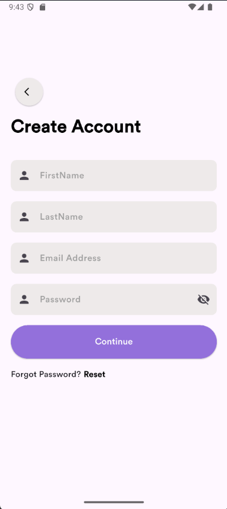
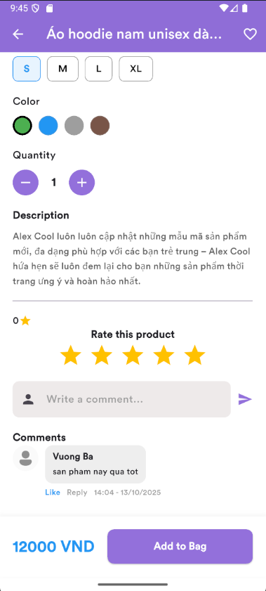
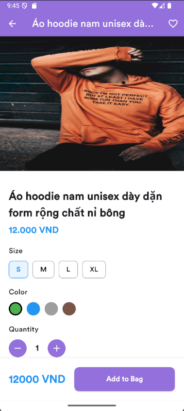

# 🛍️ E-Commerce App with Supabase

## 📘 Introduction
Đây là một ứng dụng **E-Commerce** (mua sắm trực tuyến) được xây dựng bằng **Flutter** và **Supabase**. Ứng dụng cho phép người dùng đăng ký, đăng nhập, xem sản phẩm, thêm vào giỏ hàng, yêu thích sản phẩm và thanh toán đơn hàng.

---

## 🚀 Features
- 🔐 **Authentication**: Đăng ký, đăng nhập, quên mật khẩu.
- 🏠 **Home Screen**: Hiển thị danh mục, sản phẩm nổi bật, sản phẩm bán chạy.
- ❤️ **Favorite Products**: Lưu danh sách sản phẩm yêu thích.
- 🛒 **Cart Management**: Thêm, xóa, cập nhật sản phẩm trong giỏ hàng.
- 💳 **Payment Integration** (Paymob): Tích hợp cổng thanh toán trực tuyến.
- 👤 **User Profile**: Xem và chỉnh sửa thông tin cá nhân.
- 🔎 **Search Products**: Tìm kiếm sản phẩm theo tên hoặc danh mục.
- 💬 **Product Details & Reviews**: Hiển thị mô tả, màu sắc, kích cỡ và đánh giá sản phẩm.
- 🎬 **Splash Screen**: Màn hình khởi động hiển thị logo ứng dụng.

---

## 🧱 Project Structure
```
E-Commerce-App/
│   main.dart
│
├───core
│   ├───components          # Các widget dùng chung như Button, Card, TextField,...
│   ├───functions           # Các hàm tiện ích như format, navigation, API service
│   └───models              # Các model dữ liệu (User, Product, Purchase,...)
│
└───views
    ├───auth                # Đăng ký, đăng nhập, quên mật khẩu
    ├───cart                # Giỏ hàng
    ├───favorite            # Sản phẩm yêu thích
    ├───home                # Trang chủ
    ├───product_details     # Chi tiết sản phẩm
    ├───profiles            # Hồ sơ người dùng
    └───splash              # Màn hình khởi động
```

---

## 🧰 Technologies Used
| Công nghệ | Mô tả |
|------------|-------|
| **Flutter** | Xây dựng giao diện đa nền tảng |
| **Dart** | Ngôn ngữ lập trình chính |
| **Supabase** | Backend: Auth, Database, Storage |
| **Cubit / BLoC** | Quản lý trạng thái |
| **Paymob API** | Cổng thanh toán |
| **Dio** | Gọi API |
| **CachedNetworkImage** | Tối ưu hiển thị ảnh sản phẩm |

---

## ⚙️ Setup
### 1️⃣ Clone dự án
```bash
git clone https://github.com/Vuonggba1403/EcommerceApp_Supabase
```

### 2️⃣ Cài đặt dependencies
```bash
flutter pub get
```

### 3️⃣ Cấu hình Supabase & Paymob
- Tạo project trên **Supabase** và lấy URL + Key trong `sensitive_data.dart`
- Tạo tài khoản **Paymob** và thêm API key trong file cấu hình

### 4️⃣ Chạy ứng dụng
```bash
flutter run
```

---

## 📸 Screenshots








